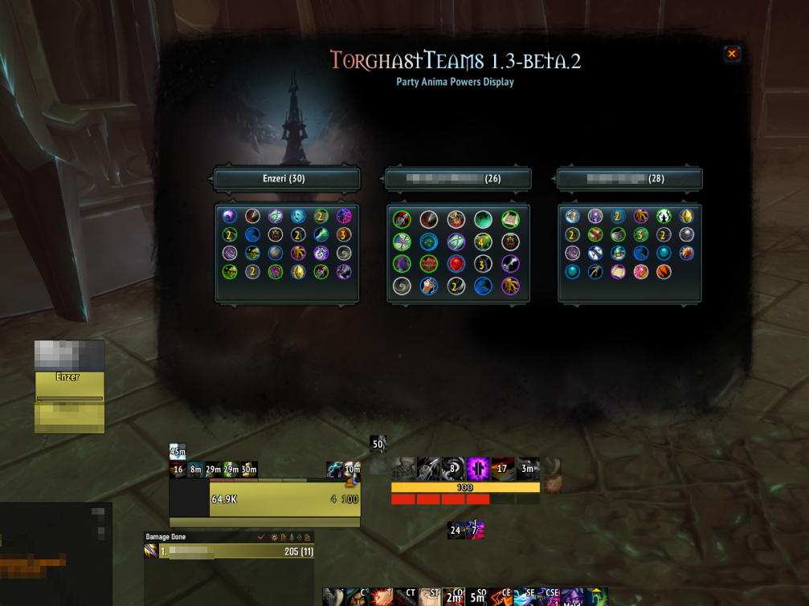
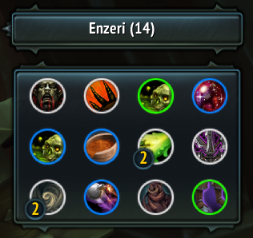
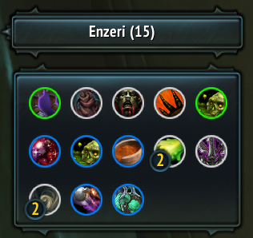
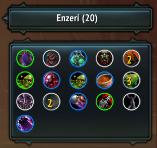
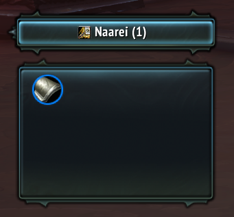
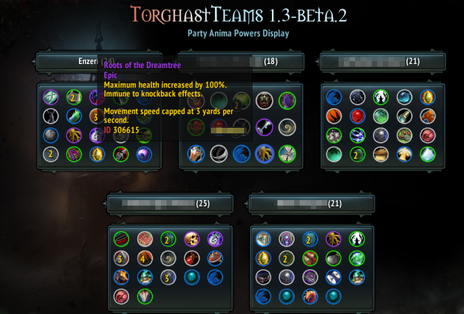
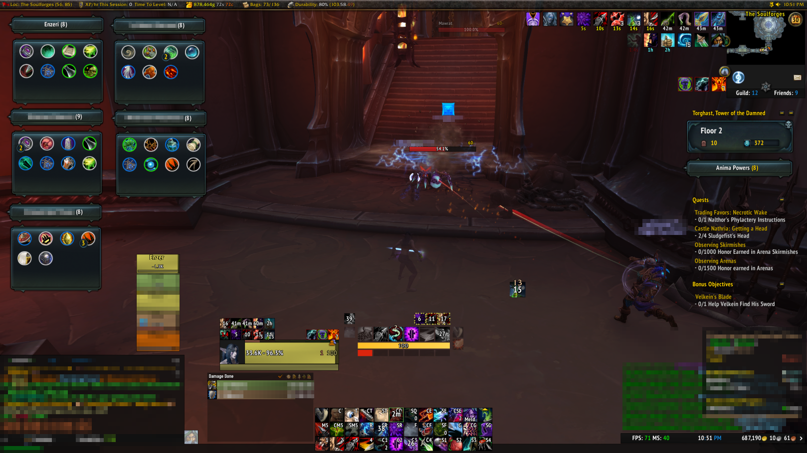

<h1 id="topBanner"align="center">
  
</h1>
<h2 align="center">
  
</h2>

[Releases][release]&nbsp;&nbsp;&nbsp;|&nbsp;&nbsp;&nbsp;[Features](#features)&nbsp;&nbsp;&nbsp;|&nbsp;&nbsp;&nbsp;[Commands](#commands)&nbsp;&nbsp;&nbsp;|&nbsp;&nbsp;&nbsp;[Screenshots](#screenshots)&nbsp;&nbsp;&nbsp;|&nbsp;&nbsp;&nbsp;[Planned](#planned)&nbsp;&nbsp;&nbsp;|&nbsp;&nbsp;&nbsp;[Issues][issues]

**[TorghastTeams](https://www.curseforge.com/wow/addons/torghastteams)** is the best tool to use when you're running Torghast, Tower of the Damned, with friends, guildmates, or randoms. See what [anima powers](https://www.wowhead.com/guides/torghast-anima-power-upgrades) they pick up and what their builds look like in a simple-to-understand display.

<h2 id="features" align="center">  
  
</h2>

TorghastTeams is an AddOn that is designed to make it much friendlier to know what Anima Powers your party members pick up during your run in Torghast. It can be really useful to know what sorts of powers your friends have so you can better plan how you approach certain pulls or bosses. (Maybe your Rogue got a crazy [AoE](https://www.wowdb.com/spells/343245-backup-poison-injectors) [build](https://www.wowdb.com/spells/343237-boiling-poison-sores) so you can make those pulls a bit bigger!) However, the only way to know that, without this AddOn, is to memorize what powers they pick up from the chat window or by asking them. Instead, TorghastTeams provides a simple-to-understand interface that lets anyone see what powers their party members have, just like the default frames, plus some more! 

Below are listed the features which TorghastTeams includes!

- [Anima Powers Display](#partymemberspowers) for all teammates in your party, updated in real time.
  - Automatic hiding of frames on party size change, incase someone bails your group. 😢
- [Dynamic Anima Power Resizing](#dynamicresizing) to fit the container based on amount of unique anima powers.
- [Class Icons](#classicons) to easily identify which powers belong to what class.
- [Mouseover Tooltips](#hovertooltips) for all party members' anima powers.
- [Simple/Unobtrusive Mode](#simplemode) for when you need to save more screen space.
  - Drag and drop frames around your screen, location gets saved for your next runs.
  - Toggle between default and simple mode with minimap button left-click.

<h2 id="commands" align="center">  
  
</h2>

`/tgt, /torghastteams` - *displays help message relating to the commands below*

`/tgt show` - *displays the TorghastTeams UI*

`/tgt hide` - *hides the TorghastTeams UI*

`/tgt minimap` - *toggles display of the TorghastTeams minimap button*

<h2 id="screenshots" align="center">  
  
</h2>

  <h3>Party Member Powers</h3>

  

  *Click the minimap button or use the 'show' command to open up this display in Torghast! Automatically shows frames for however many party members are in your current Torghast run. Dynamically removes frames if someone has to leave your party.*

  <h3>Dynamic Resizing</h3>

  

  *Anima Powers will scale in size based on the amount of unique powers, making it easy to see all of the powers available, while still saving screen real estate when partying up with multiple players.*  

  <h3>Class Icons</h3>

  

  *View class icons on the Anima Powers Display, allowing you to quickly identify your party member's classes at a glance. Note: Not shown in other screenshots as they were taken before we added class icons.*

  <h3>Hover Tooltips</h3>

  

  *You can hover over Anima powers and shift-click them to generate a link in chat, just like in the default frames. Share those cool powers you saw someone in your party get!*

  <h3>Simple/Unobtrusive Mode</h3>

  

  *Easily move frames around and to the corner of your screen if you don't want to have the big TorghastTeams interface open all the time. Moved frame will remember their position per character, and the mode you choose will also be remembered! Toggle this by Ctrl-left clicking the minimap icon.*

<h2 align="center" id="planned">  
  
</h2>
Everything below is subject to change, but these are feature we are considering releasing in the future.

- Track information about your Torghast runs.
  - How many times you've picked up each available Anima Power per character.
  - Most/least anima powers collected in a run.
  - Amount of runs done in a party size of N.

- More user configuration options.

<h2 id="feedback" align="center">
  
</h2>

Have a suggestion for some options, or want to report a bug? Open an [issue][issues]!

[CurseForge](https://www.curseforge.com/wow/addons/torghastteams)&nbsp;&nbsp;&nbsp;|&nbsp;&nbsp;&nbsp;[Back to Top](#topBanner)&nbsp;&nbsp;&nbsp;|&nbsp;&nbsp;&nbsp;[Authors](https://github.com/maxheyn/TorghastTeams/graphs/contributors)

[release]:https://github.com/maxheyn/TorghastTeams/releases/latest "Latest Release (external link)"
[issues]:https://github.com/maxheyn/TorghastTeams/issues "Issues (external link)"
