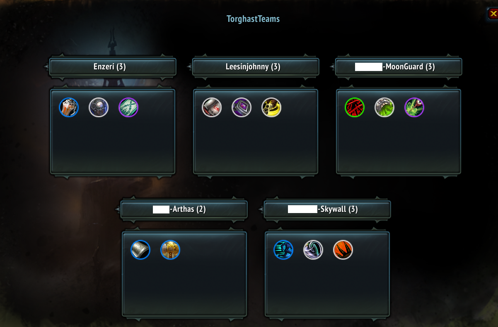
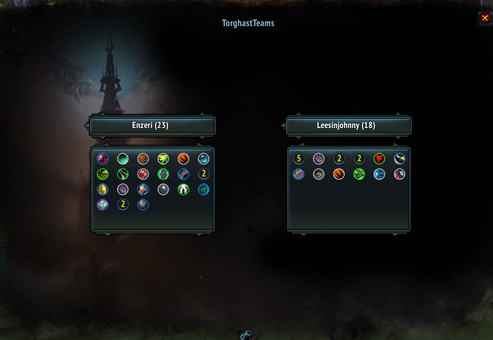

<h1 id="topBanner"align="center">
  
</h1>
<h2 align="center">
  
</h2>

[Releases][release]&nbsp;&nbsp;&nbsp;|&nbsp;&nbsp;&nbsp;[Features](#features)&nbsp;&nbsp;&nbsp;|&nbsp;&nbsp;&nbsp;[Commands](#commands)&nbsp;&nbsp;&nbsp;|&nbsp;&nbsp;&nbsp;[Screenshots](#screenshots)&nbsp;&nbsp;&nbsp;|&nbsp;&nbsp;&nbsp;[Planned](#planned)&nbsp;&nbsp;&nbsp;|&nbsp;&nbsp;&nbsp;[Issues][issues]

**[TorghastTeams](https://www.curseforge.com/wow/addons/torghastteams)** is the best tool to use when you're running Torghast, Tower of the Damned, with friends, guildmates, or randoms. See what [anima powers](https://www.wowhead.com/guides/torghast-anima-power-upgrades) they pick up and what their builds look like in a simple-to-understand display.

<h2 id="features">Features</h2>

- [View your, and your teammate's Torghast anima powers in real time.](#TGT_Party5)
- Mouse over teammate's anima powers to see what they do.
- Dynamic anima power resizing to fit the container based on amount of unique anima powers.
- Automatic hiding of frames on party size change, incase someone bails your group. 😢
- Toggle UI with commands or minimap button left-click.

<h2 id="commands">Commands</h2>

`/tgt, /torghastteams` - *displays help message relating to commands*

`/tgt show` - *displays the TorghastTeams UI*

`/tgt hide` - *hides the TorghastTeams UI*

`/tgt minimap` - *toggles display of the TorghastTeams minimap button*

<h2 id="screenshots">Screenshots</h2>

  
  Anima Powers Display when partied with 5 players

  
  Anima Powers Display when partied with 2 players

<h2 id="planned">Planned</h2>
Everything below is subject to change, but these are feature we are considering releasing in the future.

- Track information about your Torghast runs.
  - How many times you've picked up each available Anima Power per character.
  - Most/least anima powers collected in a run.
  - Amount of runs done in a party size of N.

- Save location information when frames are dragged.
- More user configuration options.
  - Have a suggestion for some options? Open an [issue][issues]!

[CurseForge](https://www.curseforge.com/wow/addons/torghastteams)&nbsp;&nbsp;&nbsp;|&nbsp;&nbsp;&nbsp;[Back to Top](#topBanner)&nbsp;&nbsp;&nbsp;|&nbsp;&nbsp;&nbsp;[Authors](https://github.com/maxheyn/TorghastTeams/graphs/contributors)

[release]:https://github.com/maxheyn/TorghastTeams/releases/latest "Latest Release (external link)"
[issues]:https://github.com/maxheyn/TorghastTeams/issues "Issues (external link)"
