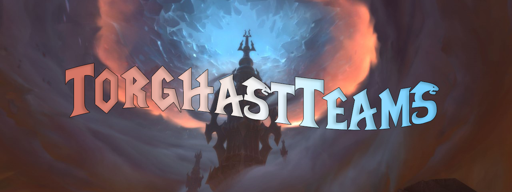

<h1 align="center">
  
</h1>
<h2 align="center">
  
</h2>

[Releases][release]&nbsp;&nbsp;&nbsp;|&nbsp;&nbsp;&nbsp;[Features](#features)&nbsp;&nbsp;&nbsp;|&nbsp;&nbsp;&nbsp;[Commands](#commands)&nbsp;&nbsp;&nbsp;|&nbsp;&nbsp;&nbsp;[Screenshots](#screenshots)&nbsp;&nbsp;&nbsp;|&nbsp;&nbsp;&nbsp;[Planned](#planned)&nbsp;&nbsp;&nbsp;|&nbsp;&nbsp;&nbsp;[Issues][issues]

**TorghastTeams** is your best friend when you're running Torghast, Tower of the Damned, with your buddies.
Currently displays up to 24 unique anima powers at once, more planned.

<h2 id="commands">Commands</h2>

`/tgt, /torghastteams` - *displays help message relating to commands*
`/tgt show` - *displays the TorghastTeams UI*
`/tgt hide` - *hides the TorghastTeams UI*
`/tgt minimap` - *toggles display of the TorghastTeams minimap button*

<h2 id="features">Features</h2>

- View your, and your teammate's anima powers in real time in the UI.
- Mouse over teammate's anima powers to see what they do.
- Toggle UI with commands or minimap button left-click.
- Reposition UI with drag-and-drop.
- Automatic rescaling on party size change, incase someone bails your group. :(

<h2 id="planned">Planned</h2>

- Dynamic anima power resizing / pagination / scrollbar.
    -  Anything to make it so that the powers don't have to be so small to fit at the moment.
- More information on the UI, such as tracking some statistics about your runs.
    - Things to fill the empty space in lower party count / solo runs, basically.
- More user configuration settings, not sure what yet.

<h2 id="screenshots">Screenshots</h2>

- Coming soon!

[release]:https://github.com/maxheyn/TorghastTeams/releases/latest "Latest Release (external link)"
[issues]:https://github.com/maxheyn/TorghastTeams/issues "Issues (external link)"
